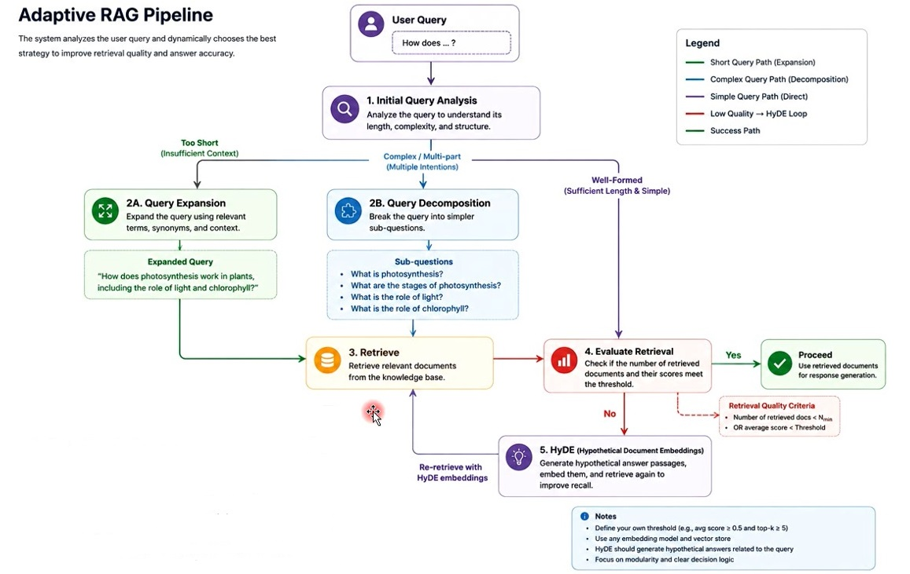
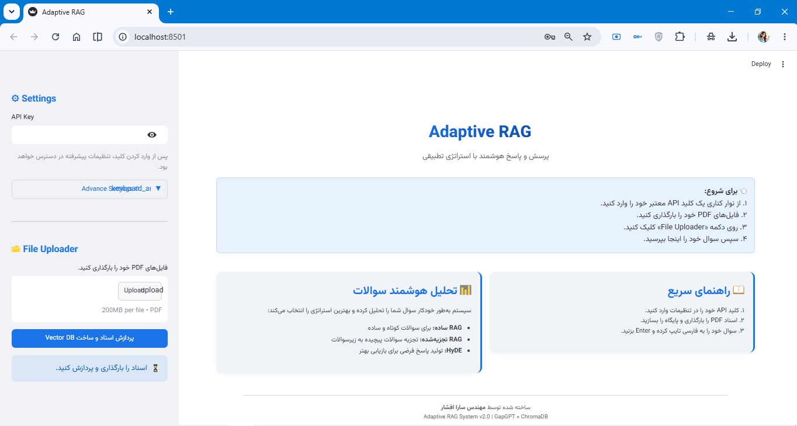
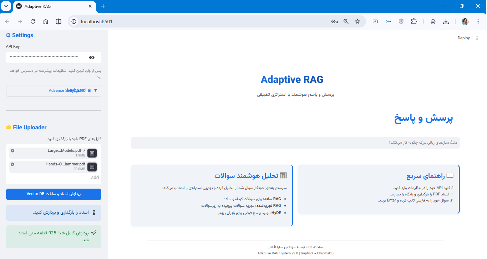

# Adaptive RAG System (Persian Optimized)

An intelligent **Adaptive Retrieval-Augmented Generation (RAG)** system designed for Persian documents, capable of dynamically selecting the most effective retrieval strategy based on query complexity.

Built with **LangChain**, **ChromaDB**, **Streamlit**, and **LLMs**, this project improves retrieval accuracy through **Query Expansion**, **Query Decomposition**, and **HyDE (Hypothetical Document Embeddings)**.

---

## Features

* 📄 PDF document ingestion
* 🔍 Semantic search using vector embeddings
* 🧠 Adaptive query routing
* 🔄 Automatic fallback mechanisms
* 🇮🇷 Persian language optimized
* ⚙️ Fully configurable retrieval pipeline
* 💬 Interactive Streamlit interface

---

## Problem Statement

Traditional RAG systems apply the same retrieval workflow to every query regardless of complexity.

This creates challenges when:

* Queries are too short and lack context.
* Questions are complex and require multi-step reasoning.
* User terminology differs from document terminology.

To address these issues, this project dynamically selects among multiple retrieval strategies.

---

## System Architecture



### Workflow

1. User submits a question.
2. Query complexity is analyzed.
3. Appropriate retrieval strategy is selected.
4. Relevant documents are retrieved.
5. LLM generates the final answer.

---

## Retrieval Strategies

### 1. Smart Routing

The system first classifies incoming questions into:

* Simple Queries
* Complex Queries

Then routes them through the most suitable pipeline.

---

### 2. Query Expansion

Used for short and under-specified questions.

Example:

**Original Query**

```text
مزایای شبکه عصبی؟
```

Expanded Query:

```text
مزایای استفاده از شبکه‌های عصبی مصنوعی در یادگیری ماشین و هوش مصنوعی چیست؟
```

This provides richer semantic signals for retrieval.

---

### 3. Decomposed RAG

Used for analytical and multi-part questions.

Example:

```text
تفاوت یادگیری عمیق و یادگیری ماشین چیست و هر کدام چه کاربردهایی دارند؟
```

The system:

1. Breaks the question into sub-questions.
2. Retrieves evidence separately.
3. Generates partial answers.
4. Synthesizes a final comprehensive response.

To reduce hallucinations, the generation temperature is automatically lowered during decomposition.

---

### 4. HyDE (Hypothetical Document Embeddings)

HyDE acts as an advanced retrieval enhancement technique.

Instead of directly searching with the user query:

1. The LLM generates a hypothetical answer.
2. The hypothetical answer is embedded.
3. Vector search is performed using that embedding.

This often retrieves semantically relevant documents even when wording differs significantly.

---

### 5. Automatic Fallback Mechanism

If:

* No relevant chunks are found
* Retrieved context quality is poor
* Generated answers are insufficient

The system automatically switches to HyDE-based retrieval.

This ensures users always receive the best possible response.

---

## User Interface

Built with Streamlit for simplicity and flexibility.

### Main Interface



### Advanced Configuration Panel



---

## Configurable Parameters

### LLM Settings

| Parameter   | Description                  |
| ----------- | ---------------------------- |
| API Key     | Provider authentication      |
| Base URL    | Custom endpoint or local LLM |
| Model Name  | LLM selection                |
| Temperature | Creativity vs precision      |
| Max Tokens  | Response length limit        |

### Retrieval Settings

| Parameter       | Description                |
| --------------- | -------------------------- |
| Chunk Size      | Size of document chunks    |
| Chunk Overlap   | Overlap between chunks     |
| Embedding Model | Embedding generation model |
| Top-K           | Number of retrieved chunks |

### Database Settings

| Parameter         | Description                        |
| ----------------- | ---------------------------------- |
| Persist Directory | Local vector database storage path |

---

## Tech Stack

* Python
* LangChain
* ChromaDB
* OpenAI API
* Local LLMs (Ollama Compatible)
* PyPDF
* Streamlit

---

## Installation

Clone the repository:

```bash
git clone https://github.com/afshars/adaptive-rag.git
cd adaptive-rag
```

Install dependencies:

```bash
pip install -r requirements.txt
```

Run the application:

```bash
streamlit run app.py
```

---

## Project Structure

```text
02-Adaptive RAG/
├── images/               # Screenshots and architecture diagrams
├── README.md             # Project documentation
├── adaptive_rag.py       # Core logic, RAG pipeline and strategies
├── app.py                # Streamlit UI and entry point
└── requirements.txt      # Project dependencies

```

---

## Contributions

Contributions, issues, and feature requests are welcome.

Feel free to open an issue or submit a pull request.

---

## 👤 About the Author

**Sarah M. Afshar**  
*Python Developer specializing in Generative AI*

Focused on Large Language Models (LLMs), neural network fundamentals, and intelligent system development.

🔗 **GitHub:** [https://github.com/afshars](https://github.com/afshars)  
🔗 **LinkedIn:** [https://www.linkedin.com/in/sara-m-afshar/](https://www.linkedin.com/in/sara-m-afshar/)
