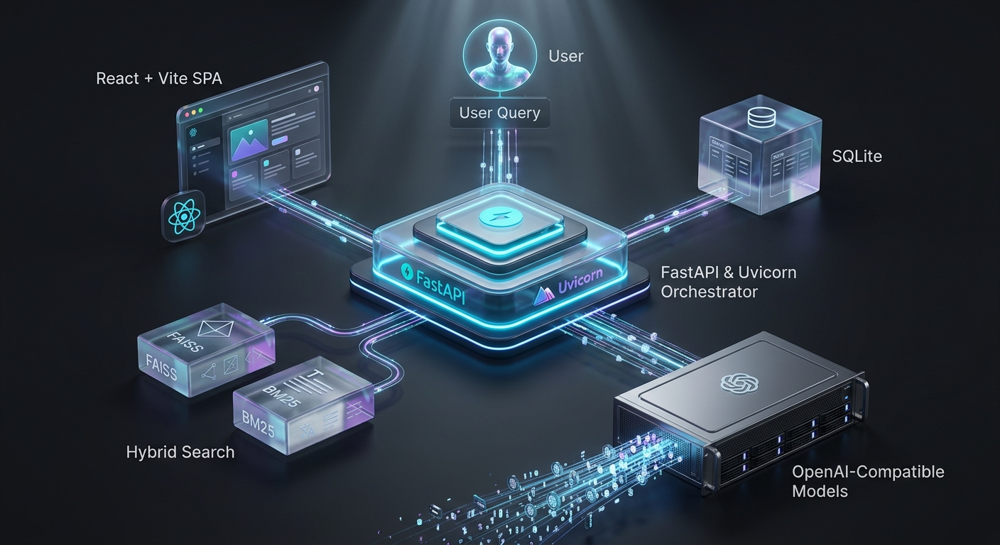
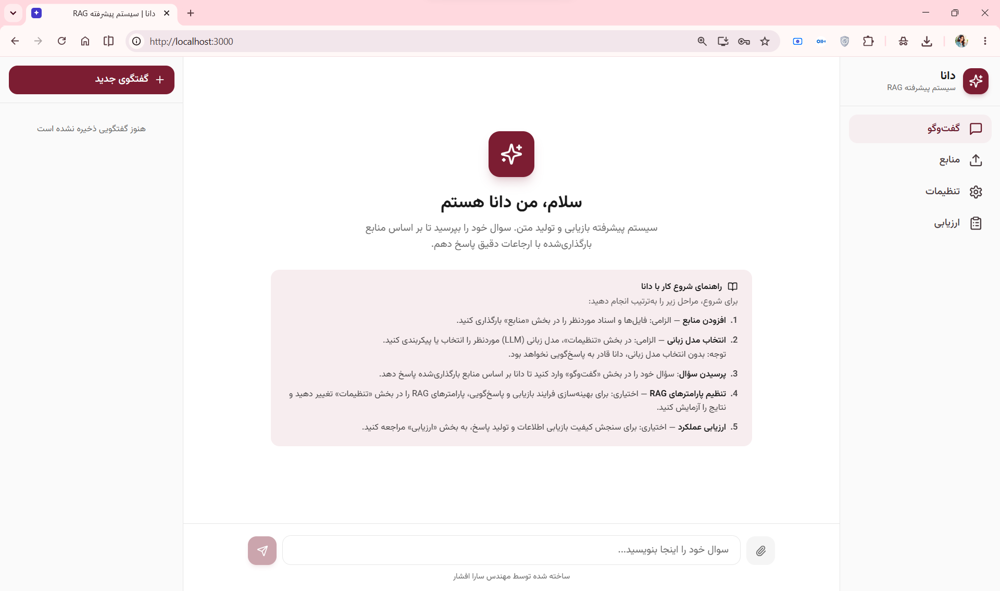
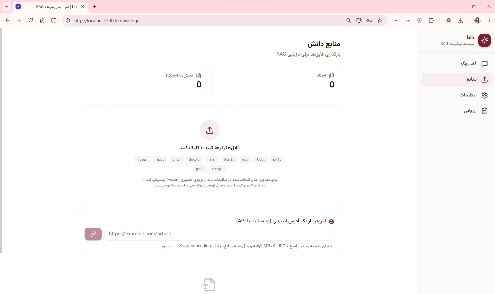
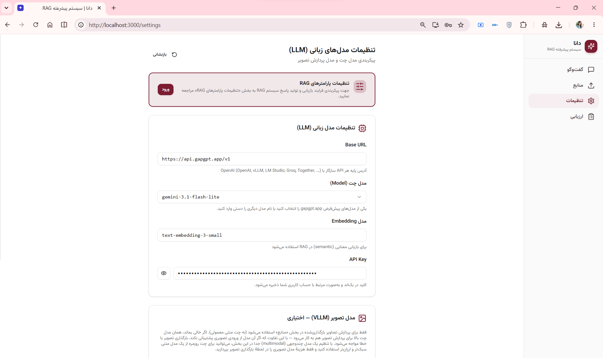
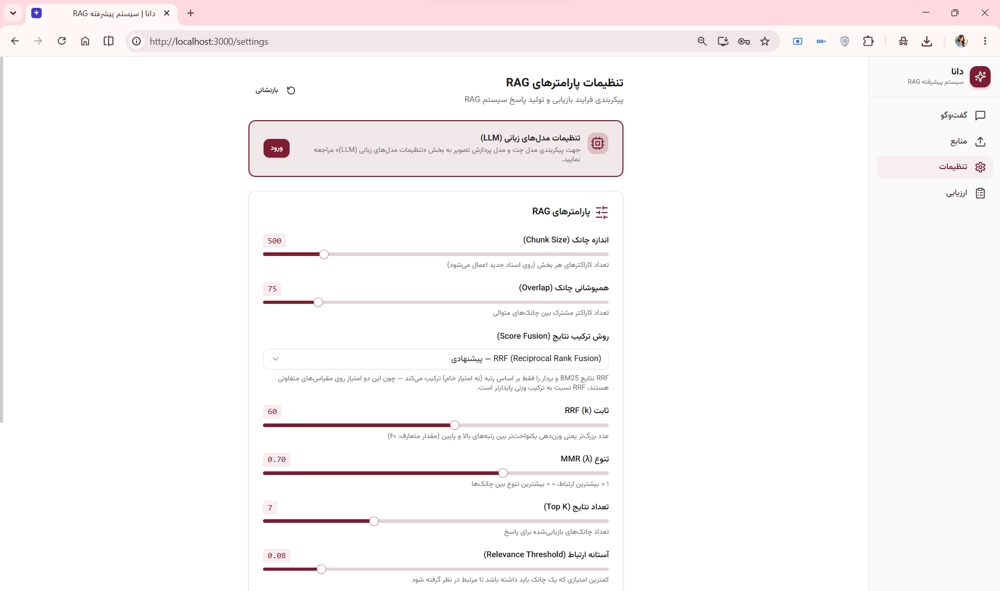
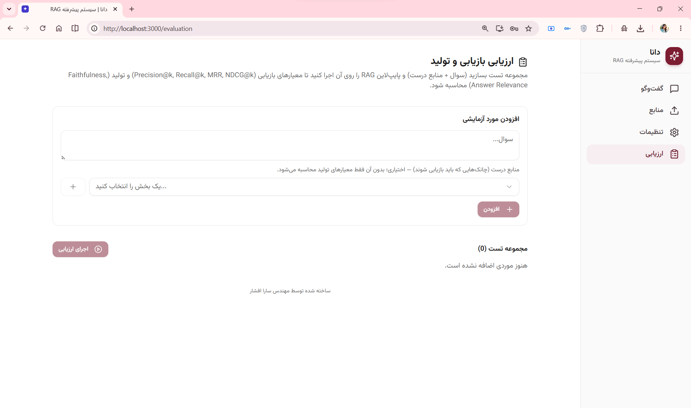

<div align="center">

#  Dana App

### A production-ready Retrieval-Augmented Generation system designed for Persian-speaking users


**Upload your data → Build a knowledge base → Ask questions → Get grounded answers with citations**



</div>

---
## Overview

**Dana** is a full-stack application based on Retrieval-Augmented Generation (RAG), designed for Persian-speaking users. It enables users to build searchable knowledge bases from documents, images, web pages, and APIs.

Instead of relying entirely on the internal knowledge of a Large Language Model (LLM), Dana retrieves relevant passages from the user's own data and uses them to generate grounded answers. These answers are provided with source citations and confidence indicators.

Unlike minimal RAG demos, Dana offers advanced features, including:

- A persistent hybrid retrieval pipeline;
- Configurable reranking;
- Semantic content chunking;
- Multimodal data ingestion and processing;
- Performance evaluation tools;
- Dedicated indexes for each user;
- Real-time streaming responses;
- A Dockerized setup for consistent local development.

---

## Key Features

- 🇮🇷 User interface designed for Persian-speaking users with RTL support
- 📄 Ingestion of PDF, DOCX, Markdown, TXT, HTML, and image files
- 🌐 Web page and JSON API ingestion
- 🧩 Fixed-size and semantic chunking
- 🔍 Hybrid retrieval using FAISS and BM25
- 🧠 Advanced query processing with Query Decomposition and HyDE
- 🔀 Reciprocal Rank Fusion (RRF) and weighted fusion
- 🎯 MMR-based result diversification
- 🏆 Cross-Encoder reranking with automatic LLM-based fallback
- 📚 Source citations and document metadata
- 📊 Retrieval and response-generation evaluation
- ⚡ Streaming responses using Server-Sent Events (SSE)
- 🔌 Support for OpenAI-compatible APIs
- 🐳 Docker Compose setup for consistent local development

---

## Supported Knowledge Sources

| Source Type | Supported Formats |
|---|---|
| Documents | PDF, DOCX, Markdown, TXT, HTML, and HTM |
| Images | PNG, JPG, JPEG, WEBP, and GIF |
| Web Sources | HTML web pages and JSON API responses |

Images can be processed using a vision-capable language model to extract visible text and generate descriptions of diagrams, tables, charts, and other visual content.

---

## Architecture

```text
                     👤 USER
                        │
                        ▼
              ┌──────────────────┐
              │ React + Vite SPA │
              │      Nginx       │
              └────────┬─────────┘
                       │ REST API
                       ▼
         ┌────────────────────────────┐
         │     FastAPI + Uvicorn      │
         │                            │
         │  RAG Pipeline Orchestrator │
         └─────┬────────┬────────┬────┘
               │        │        │
               ▼        ▼        ▼
           SQLite     FAISS     BM25
                       └────┬─────┘
                      Hybrid Search
                            │
                            ▼
              OpenAI-Compatible Models
                            │
                      Streamed Tokens
                            │
                         SSE ▼
                       Frontend

```

The frontend and backend run in separate Docker containers and communicate through Docker’s internal network. The application is currently configured and tested for local deployment using Docker Compose.

---
 
## Features and Techniques

Dana's RAG pipeline consists of six independent and configurable stages:

### 1. Source Ingestion and Processing

- Supports `PDF`, `DOCX`, `HTML`, `Markdown`, and `TXT` files
- Automatically extracts document titles, authors, and publication dates
- Extracts text and describes image content using vision models
- Ingests content directly from web pages and JSON APIs
- Provides basic protection against SSRF attacks

### 2. Text Chunking

- Character-based chunking with configurable overlap and intelligent boundaries
- Semantic chunking using `LangChain SemanticChunker`
- Preserves semantic coherence and avoids splitting sentences unnecessarily

### 3. Embedding and Indexing

- Compatible with standard and OpenAI-compatible embedding endpoints
- Vector similarity search using `FAISS`
- Lexical and keyword-based search using `BM25`
- Maintains isolated indexes for each user
- Persists indexes and related data under `/app/data`

### 4. Advanced Hybrid Retrieval 

```text

User Query
   ├── Query Decomposition
   ├── BM25 Lexical Retrieval
   └── HyDE → FAISS Semantic Retrieval
│
RRF → MMR → Reranking
│
Final Context

```

- **Query Decomposition:** Breaks complex questions into focused subqueries
- **HyDE:** Generates hypothetical documents to improve semantic retrieval
- **RRF:** Combines ranked results from `BM25` and `FAISS`
- **MMR:** Improves diversity and reduces redundancy among retrieved chunks
- **Cross-Encoder Reranking:** Reranks candidates using the multilingual `cross-encoder/mmarco-mMiniLMv2-L12-H384-v1` model
- **LLM-based Fallback:** Uses an LLM when Cross-Encoder reranking fails
- **Graceful Degradation:** Falls back to TF-IDF retrieval when primary indexes are unavailable


### 5. Response Generation

- Streams responses using `Server-Sent Events`
- Supports OpenAI, GapGPT, Groq, vLLM, LM Studio, and other compatible APIs
- Generates grounded responses based on retrieved context
- Displays citations and source metadata
- Reports confidence as `High`, `Medium`, `Low`, or `No Sources`
- Supports image input for multimodal models

### 6. Quality Evaluation

- Retrieval metrics: `Precision@k`, `Recall@k`, `MRR`, and `NDCG@k`
- Response evaluation using an **LLM-as-a-Judge**
- Measures **Faithfulness**, **Answer Relevance**, and **Context Precision**

---

## ⚙️ FastAPI-Based Backend

Dana's backend is fully designed and implemented with **FastAPI**, leveraging the following capabilities:

- **Asynchronous Architecture:** SSE-based response streaming and concurrent calls to LLM and embedding services are handled using `httpx.AsyncClient` and the asynchronous version of `SQLAlchemy`, without blocking the server.
- **Data Validation and Modeling with Pydantic:** API requests, responses, and project environment settings in `config.py` are defined through Pydantic schemas and validated automatically.
- **Interactive API Documentation:** Complete Swagger documentation is generated automatically and is available at `/docs`.
- **Performance and Maintainability:** Clear type hints, a modular structure, and FastAPI's built-in capabilities simplify backend development, maintenance, and future extension.

---

## User Interface

### 1. Chat Page (Home)
The central interaction hub with real-time streaming, multimodal support, and grounded citations.



### 2. Knowledge Base
A comprehensive workspace for managing data sources, supporting various file formats and web-based ingestion.



### 3. RAG & LLM Configuration
Granular control over the retrieval pipeline and model parameters, allowing fine-tuning of the RAG behavior.

| LLM Settings | RAG Parameters |
| :---: | :---: |
|  |  |

### 4. Evaluation Dashboard
A dedicated environment to measure system performance using industry-standard RAG metrics.



---

## Frontend–Backend Integration

- The frontend communicates with the backend through **REST APIs** for managing knowledge sources, settings, and conversations, while **Server-Sent Events (SSE)** are used to stream chat responses in real time.
- The backend address is configured through the `VITE_API_BASE_URL` environment variable. Because Vite injects environment variables into the JavaScript bundle at **build time**, rather than at runtime, this value is passed to the frontend Dockerfile as a build argument.
- In the current **local development environment**, the frontend connects directly to the backend at `http://localhost:8000`, with CORS configured to allow requests from `http://localhost:3000`.
- An optional `Caddyfile` is included for future deployment. It can serve the frontend and reverse-proxy backend requests under a shared origin, allowing the frontend to use relative API paths such as `/chat` and `/knowledge` without requiring a separate public backend URL.

---

## Where Does Each Component Run?

| Service | Serving Technology | Internal Port | Responsibility |
|---|---|---:|---|
| **Backend** | Uvicorn (ASGI) running FastAPI | `8000` | Provides the API and executes the RAG pipeline |
| **Frontend** | Nginx serving the static Vite build | `80` | Delivers the SPA to the user's browser |
| **Reverse Proxy** *(production only)* | Caddy 2 | `80` / `443` | Routes incoming traffic and automatically provisions HTTPS certificates through Let's Encrypt |

Persistent data—including the SQLite database and the FAISS/BM25 indexes—is stored in a Docker volume named `backend_data`. This storage is independent of the container lifecycle, meaning the data remains intact after running `docker compose down` and starting the services again with `docker compose up`.

---

## Dockerization Strategy

- The backend relies on several heavyweight and version-sensitive dependencies, including `faiss-cpu`, `sentence-transformers`—which depends on `torch`—and the LangChain ecosystem. Installing these packages manually across different operating systems can easily lead to dependency and version conflicts. Docker provides a fully isolated, consistent, and reproducible runtime environment.

- **Explicit backend image optimization:** By default, installing `sentence-transformers` may pull a large CUDA-enabled build of `torch`, adding several hundred megabytes even though the reranker runs entirely on the CPU. To avoid this overhead, the backend Dockerfile explicitly installs the CPU-only version of PyTorch from the official PyTorch package index before processing `requirements.txt`. The subsequent installation detects the dependency as already satisfied, resulting in a significantly smaller final image.

- **Multi-stage frontend build:** The first stage uses Node.js to compile the React application, while the second stage copies only the generated static assets into a lightweight Nginx image. This approach produces a substantially smaller production image because the final container does not include Node.js, source files, or build-time dependencies.

- The entire stack—including the backend, frontend, database, and search indexes—can be started with a single command:

```bash
docker compose up --build
```

### Running Locally

Clone the repository, navigate to the project directory, and create the environment configuration file:

```bash

git clone <repository-url>

cd dana-app

cp .env.example .env

docker compose up --build

```

Once all services are up and running, open the application in your browser:
```
http://localhost:3000

```

### Useful Commands

| Task | Command |
|---|---|
| Stop and remove all containers | `docker compose down` |
| Restart the services without rebuilding | `docker compose up` |
| Follow the backend logs | `docker compose logs -f backend` |
| Rebuild and apply the latest code changes | `docker compose up --build` |
| Remove all persistent data and start from scratch | `docker compose down -v` |


### Production Deployment with Automatic HTTPS

Create the production environment file and configure the required variables:

```bash
cp .env.prod.example .env.prod
```

Set `DOMAIN` and `CORS_ORIGINS` in `.env.prod`, then start the production stack:

```bash
docker compose \
  --env-file .env.prod \
  -f docker-compose.prod.yml \
  up --build -d

```
---

## Tech Stack

### Backend

`FastAPI` · `Uvicorn` · `SQLAlchemy (Async)` · `aiosqlite` · `Pydantic v2` · `httpx` · `LangChain` / `langchain-experimental` · `FAISS` · `rank-bm25` · `sentence-transformers` · `pypdf` · `python-docx` · `BeautifulSoup4`

### Frontend

`React 18` · `Vite` · `Tailwind CSS` · `Radix UI` / `shadcn/ui` · `TanStack Query` · `React Router` · `Framer Motion` · `React Markdown` · `Lucide React` · `Sonner`

### Infrastructure

`Docker` · `Docker Compose` · `Nginx` · `Caddy` *(reverse proxy and automatic HTTPS)*

---

## 📁 Project Structure

```text

AdvanceRAG-DanaAPP/
├── backend/
│   ├── app/
│   │   ├── rag/            # Complete RAG pipeline (chunking, embeddings, retrieval, evaluation, etc.)
│   │   ├── parsers/        # Text extraction from supported document formats
│   │   ├── routers/        # knowledge, chat, sessions, settings, evaluation
│   │   ├── models.py       # Database models
│   │   ├── schemas.py      # Pydantic schemas
│   │   ├── database.py     # Database configuration
│   │   └── main.py         # FastAPI application entry point
│   ├── Dockerfile
│   └── requirements.txt
├── frontend/
│   ├── src/
│   │   ├── pages/          # Home, Knowledge, Evaluation, Settings
│   │   ├── components/dana/# UI components such as ChatMessage, CitationsExpander, ConfidenceBadge, etc.
│   │   ├── api/            # Fetch clients for backend communication
│   │   └── lib/            # Shared utilities and configuration
│   └── Dockerfile
├── docker-compose.yml
├── docker-compose.prod.yml
└── Caddyfile

```

---

## 👤 About the Author

**Sarah Afshar**  

Python Developer specializing in Generative AI  

Focused on **Large Language Models (LLMs)**, neural network fundamentals, and intelligent system development.

🔗 GitHub: https://github.com/afshars  
🔗 LinkedIn: https://www.linkedin.com/in/sara-m-afshar/


